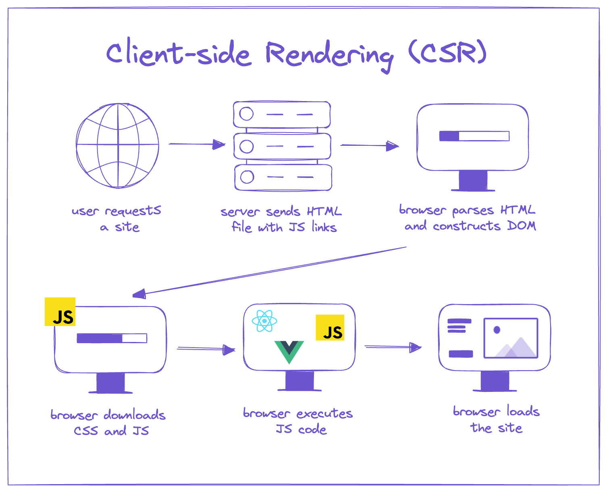

# React Fundamentals
- React is a **declarative**, **component-based** JS library for building user interfaces
- Maintained By React foundation (under Linux Foundation) earlier by Facebook / Meta
- Allow developers to create reusable components
- Uses **Virtual DOM**, a in-memory, lightweight copy of the real DOM. 
- When the state of a component changes, react first updates its virtual DOM, then efficiently calculates the minimal chnges needed to update real DOM => Better Performance


### Component LifeCycle
- 3 Phases 
1. Mounting - when the component is first rendered and inserted into DOM
2. Updating - component rerenders due to states or props chnge
3. Unmounting - component is removed from DOM


### How does react update the UI efficiently?
- Virtual DOM - react creates an in memory copy of original DOM
- Diffing Algorithm - React compares the new virtual DOM with previous one to find chnges
- Batching Updates - React groups multiple state updates and applies them together, reducing unnecessary renders
- Reconcillation - React applies only necessary chnges to real DOM

# JSX (Javascript XML)
- Javascript Syntax extension used in React
- Allow writing html like code inside JS
- Not a new lang, it's a syntatic sugar
- JSX expression must have a single root element (div / react fragment ..)

# Components - Functional vs Class
## Functional Components
- Defined as Functions
- Accepts `Props` and return `jsx`
- Hooks can be used to manage state or life cycle (using hooks, they can use all the capabilities of class components)

## Class Components
- Defined using ES6 `class` syntax
- Extends `React.Component`
- Use `this.state` and lifecycle methods
- They can manage their own state and lifecycle using its methods
- But they are more verbose and complex , and with Hooks, their use has been largely phased out

### Why Class Components are not preferred even though OOPS are preferred ?
- OOP is ideal for business logic, but UI is declarative and state-driven, so React prefers functional components because they describe what the UI should look like, not how objects should behave.

# State
- A javascript object that holds data specific to a component.
- When state of a component chnges, react re-renders the component and its children
- Mutable and used for data that can chnge, like user input, API response
- In functional components, states are manages using `useState` hook
```js
const [count, setCount] = useState (0);
//functional


this.state = {count : 0};
//class
```

### Diff b/w Variable and State 
- A normal variable is re-created on every render and does not trigger UI updates, whereas state is managed by React, preserved across renders, and triggers a re-render when it changes.

# Props
- Short for `Properties`
- Uses to pass data from parent component to child component
- “Child communicates with parent via callback props”
- **Read only and immutable** in child components
- Ensure **unidirectional** data flow, which makes application easy to debug and understand

# Hooks
- Functions that let you use states and lifecycle features in functional components
- Introduced in react 16.8 - to allow functional components to have same capability as class components


# Conditional Rendering
- Rendering UI based on conditions
- Uses javascript expressions like if, ternary operator(cond ? exp1 : exp2) or logical operators (&&)
```jsx
{isLoggedIn ? <Dashboard /> : <Login />}
```


# CSR (Client Side Rendering)
- The browser downloads a minimal HTML file.
- Then downloads JavaScript
- React renders the UI in the browser



### Flow (Interview Style)
1. Browser requests a page
2. Server returns empty/minimal HTML
3. JS bundle loads
4. React executes and builds UI
5. Data is fetched from APIs
6. UI updates

```ruby
# Pros ->
 - Faster navigation after initial load
 - Great for interactive dashboards
 - Less server load
 - Smooth SPA experience

# Cons ->
 - Slower first load
 - Poor SEO (HTML initially empty)
 - Needs JS enabled
```

<br><br>

# SSR (Server Side Rendering)
- React renders HTML on the server
- Browser receives fully rendered HTML
- JS then “hydrates” the page

```ruby
Hydration is the process where React attaches event listeners to server-rendered HTML on the client
```

### Flow (Interview Style)
1. Browser requests page
2. Server runs React
3. Server sends fully rendered HTML
4. Browser displays content immediately
5. React hydrates and becomes interactive


```ruby
# Pros ->
 - Very fast first paint
 - Excellent SEO
 - Better performance on slow devices

# Cons ->
 - Higher server cost
 - Slower page transitions
 - More complex architecture
```

| Feature       | CSR                  | SSR                          |
| ------------- | -------------------- | ---------------------------- |
| Rendering     | Browser              | Server                       |
| Initial Load  | ❌ Slow               | ✅ Fast                       |
| SEO           | ❌ Poor               | ✅ Excellent                  |
| Interactivity | Fast after load      | Slight delay                 |
| Server Cost   | Low                  | High                         |
| JS Dependency | Mandatory            | Optional (HTML works)        |
| Best Use Case | Dashboards, Web Apps | Blogs, E-commerce, SEO pages |

<br><br>

# Library vs Framework


### React is library but it feels like framework
- React is library because it focuses on UI layer
- It doesn't force rules about Routing, State Management, HTTP Calls, Folder Structure.
- We choose what to add (React Router, Redux, Zustand, Axios, etc.)

```ruby
Because when you use React with tools like:
 - Next.js (routing, SSR, build system), Redux, React Router
…it starts behaving like a framework, but React itself is still just a library.
```

# Single Page Applications
- An SPA loads one HTML page once and then updates content dynamically using JavaScript without reloading the page.

e.g, Gmails, Facebook etc.

```ruby
# How it works
 - Initial request → one HTML + JS bundle
 - Further navigation → handled by JavaScript (client-side routing)
 - Data fetched via APIs (AJAX / Fetch)
```


# Multi Page Applications
An MPA loads a new HTML page from the server for every route or action.

```ruby
# How it works
 - Every click → server request
 - Server returns a new HTML page
 - Browser reloads the page completely
```
- Examples: Amazon, Flipkart, Traditional websites (PHP, JSP, Django)
