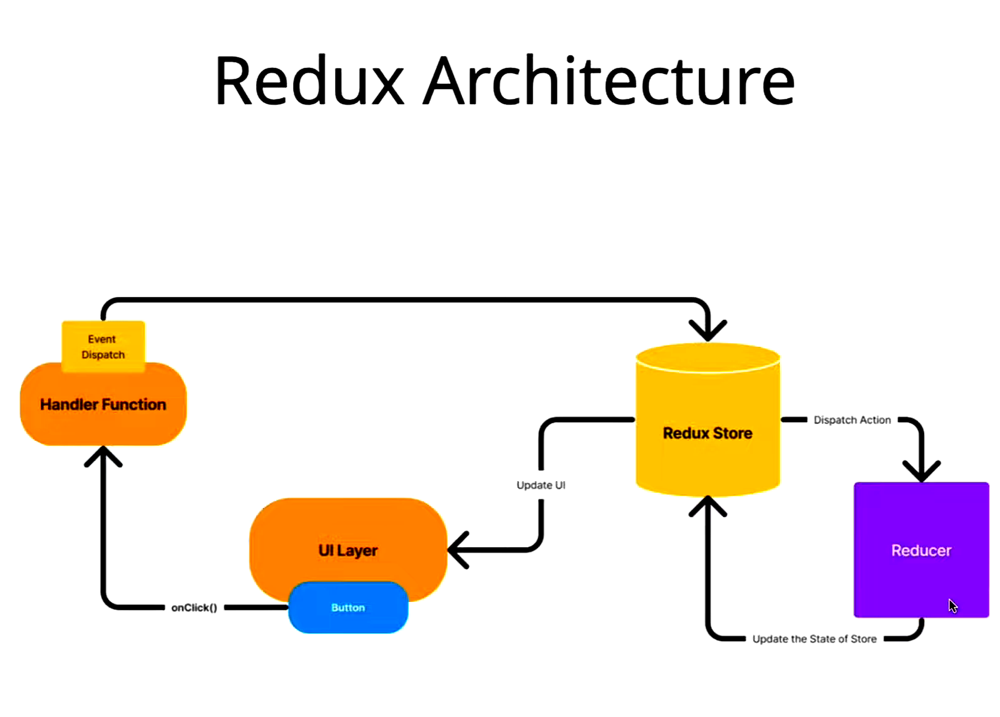

# Redux
- A state management library for JavaScript apps. (mostly with React)
- Helps managing the global state - data that multiple components need to access.
- We use `redux-toolkit` nowadays with `react-redux`.

## Without Redux:
- Data is passed down through props.
- Managing state in nested components is difficult.
- Debugging is hard because different components may change the same state, leading to data inconsistency.

## With Redux:
- Keep all shared states in one place.
- Changes happen in controlled predictable manner.
- Easily track, debug and test what's happening.


### Installation
```bash
npm install react-redux @reduxjs/toolkit
```

## Core Concepts:
1. Store

    - Centralized State Container
    - Holds entire state of your app in one object

2. Actions:

    - Simple object that describes what do you want to do
    - It has type and a payload, type -> what action needs to be performed, payload -> data sent along.
    - These are just instructions not actual logic.

3. Reducers:

    - Describe how the state changes
    - It is a pure function (no side effects like API Calls or Random Values) that takes the `(currentState, action) => newState`
    - Shouldn't mutate a state, alwyas returns a new object.

### Flow in redux (Lifecycle)
1. Component dispatches an action (using hook - useDispatch)
2. Redux store sends action to the reducer
3. Reducer calculates new state and returns it
4. Store updates the state
5. React re-renders components subscribed to that part of state (useSelector)


## Architecture Understanding



## Steps
1. First Install 
```bash
npm install react-redux @reduxjs/toolkit
```

2. Create a Slice of the Feature you want
- Slice -> A place where we define states, reducers, actions as per a feature
```js
// counterSlice.js
import { createSlice } from '@reduxjs/toolkit'

const counterSlice = createSlice({
    name: 'counter', // name of the slice
    initialState: { count: 0 }, // default state
    reducers: {
        increment: (state) => state.count += 1, // allowed direct mutations handled by RTK,
        decrement: (state) => state.count -= 1,
        incrementByAmount: (state, action) => {
            state.count += action.payload;
        }
    }
});

export const { increment, decrement, incrementByAmount } = counterSlice.actions;

export default counterSlice;
```

3. Create the Store
- Put all the slice, reducers into a store
```js
// store.js
import { configureStore } from '@reduxjs/toolkit'
import counterSlice from './counterSlice.js'

const store = configureStore({
    reducer: {
        counter: counterSlice, // we can have multiple slices later
    }
});

export default store;
```

4. Provide the Store to React
```jsx
// App.jsx
import { Provider } from 'react-redux'
import AllComponents from './Components.jsx'
import store from './store.js'
function App() {
    return(
        <Provider store={store}>
            <AllComponents />
        </ Provider>
    );
}
```

5. Use Redux State and actions in component
- Use react-redux hooks here to connect UI with store
- `useSelector` - reads data from store
- `useDispatch` - sends actions to the store 
```jsx
import { useSelector, useDispatch } from 'react-redux'
import { increment, decrement, incrementByAmount } from './counterSlice.js'

function Counter() {
    const count = useSelector((state) => state.counter.count);

    const dispatch = useDispatch();

    return(
        <div>
            <h1>Count is: {count}</h1>
            <button onClick={dispatch(increment())}>Increment</button>
            <button onClick={dispatch(decrement())}>Decrement</button>
            <button onClick={dispatch(incrementByAmount(5))}>Increment By 5</button>
        </div>
    );

    // do call the dispatch functions
}
```